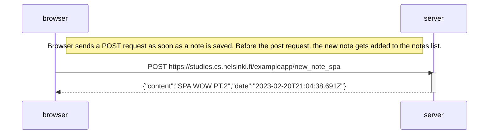

```mermaid 
sequenceDiagram
    participant browser
    participant server
    
    note right of browser: Browser sends a POST request as soon as a note is saved. Before the post request, the new note gets added to the notes list.
    browser->>server: POST https://studies.cs.helsinki.fi/exampleapp/new_note_spa
    activate server
    server-->>browser: {"content":"SPA WOW PT.2","date":"2023-02-20T21:04:38.691Z"}
    deactivate server
```
